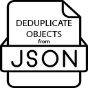

# Deduplicate Objects from JSON

<p align="center">
  
</p>

<p align="center">
  <a href="https://marketplace.visualstudio.com/items?itemName=keev-studio.deduplicate-json-objects"></a>
  <a href="https://marketplace.visualstudio.com/items?itemName=keev-studio.deduplicate-json-objects"></a>
  <a href="https://github.com/keev-studio/deduplicate-json-objects/blob/main/LICENSE"></a>
</p>

## 📋 Overview

A Visual Studio Code extension that helps you clean up JSON files by removing duplicate objects based on a specified field.

> 💡 Perfect for cleaning up data exports, API responses, or any JSON array that might contain duplicates.

## ✨ Features

- ✅ Removes duplicate objects from JSON array files
- 🔍 Lets you choose which property to use for comparison
- 🔄 Works with any property in your JSON objects
- 📝 Preserves the first occurrence of each unique object
- 📊 Shows summary of deduplication results

## 🚀 How to Use

1. Open a JSON file containing an array of objects
2. Right-click in the editor
3. Select "Deduplicate Objects from JSON" from the context menu
4. When prompted, select the property to use for deduplication (e.g., ID, name, etc.)
5. The extension will remove all duplicates based on the selected property, keeping only the first occurrence


## 📝 Example

<details>
<summary>Click to expand example</summary>

### Before:

```json
[
  {
    "id": 793,
    "quoteText": "Fortune favours the brave.",
    "quoteAuthor": "Virgil"
  },
  {
    "id": 794,
    "quoteText": "Fortune favours the brave.",
    "quoteAuthor": "Julius Caesar"
  },
  {
    "id": 795,
    "quoteText": "Fortune favours the brave.",
    "quoteAuthor": "Terence"
  }
]
```
### After (when deduplicating by "quoteText"):

```json
[
  {
    "id": 793,
    "quoteText": "Fortune favours the brave.",
    "quoteAuthor": "Virgil"
  }
]
```

⚙️ Requirements:
Visual Studio Code 1.60.0 or higher

🔧 Extension Settings:
This extension does not add any VS Code settings.

⚠️ Known Issues:
Works only with JSON files that contain arrays of objects at the root level

📝 Release Notes:
1.0.0
Initial release of Deduplicate Objects from JSON

👨‍💻 About the Author:
Created ❤️ by Keev Studio

📄 License:
MIT